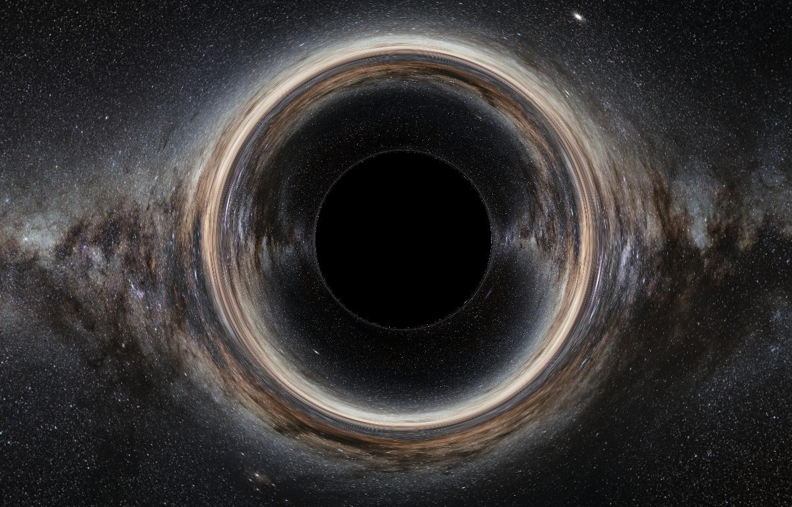

# Real-Time Black Hole Simulator

A real-time black hole visualization built with Rust and wgpu. In browsers, it prefers WebGPU on modern hardware and falls back to WebGL 2 when WebGPU is unavailable. This application simulates the visual effects of black holes using a simplified gravitational model with basic frame-dragging approximation, featuring gravitational lensing effects and interactive controls.



## Features

- ✅ **Simplified Black Hole Physics** - Approximated gravitational effects with basic frame-dragging
- ✅ **Real-Time Ray Tracing** - GPU-accelerated ray deflection through simplified gravitational model
- ✅ **Frame-Dragging Approximation** - Basic tangential effects from spinning black holes
- ✅ **Gravitational Lensing** - Visual distortion of background starfield
- ✅ **Interactive Debug Controls** - Real-time sliders for FOV, mass, spin, and ray steps
- ✅ **Performance Profiling** - High-precision timing with DWARF debug symbols for flame graphs
- ✅ **Cross-Platform** - Runs natively and in web browsers via WebAssembly
- ✅ **Multi-Input Support** - Keyboard, mouse, and touch controls
- ✅ **Responsive Design** - Adapts to different screen sizes and orientations

## Quick Start

### Prerequisites
- [Nix](https://nixos.org/download.html) (recommended)
- Or: Rust toolchain with wasm32 target, Node.js 22+, wasm-pack

### Development Setup

```bash
# Using Nix (recommended)
nix develop
cd www
npm install
npm run serve

# Or manually
rustup target add wasm32-unknown-unknown
cargo install wasm-pack
cd www
npm install
npm run serve
```

Open http://localhost:8080 in your browser.

### Production Build

```bash
cd www
npm run build
# Static files generated in www/dist/
```

## Controls

### Movement
- **W/A/S/D** - Move forward/left/backward/right
- **Space/Shift** - Move up/down  
- **Mouse Wheel** - Move forward/backward
- **Q/E** - Turn left/right
- **Mouse Move** - Look around (mouselook enabled by default, desktop)
- **Right Click** - Hold to look around (trackpad alternative)
- **Escape** - Toggle mouse lock/unlock
- **Touch** - Left half: movement joystick, Right half: look around (mobile)

### Visual Toggles
- **B** - Cycle background modes (starfield/procedural/none)
- **G** - Toggle coordinate grid overlay
- **F** - Toggle FPS counter
- **P** - Toggle performance profiling overlay
- **?** - Toggle help and debug menu

### Debug Controls (in help menu)
- **FOV Slider** - Adjust camera field of view (10° - 120°)
- **Mass Slider** - Change black hole mass (0.1 - 5.0)
- **Spin Slider** - Set black hole rotation (-1.0 to 1.0)
- **Ray Steps** - Adjust rendering quality/performance (50 - 1000)

## Physics Implementation

### Simplified Black Hole Model
The visualization currently implements a simplified gravitational model with:
- **Basic Event Horizon**: Calculated using approximate Kerr horizon radius
- **Frame-Dragging Approximation**: Simplified tangential acceleration based on spin
- **Gravitational Deflection**: Basic radial acceleration toward black hole center
- **Cartesian Coordinates**: Simple 3D space without relativistic coordinate systems

### Ray Tracing Method
- **Simplified Integration**: Basic Euler integration with adaptive step sizes in shader
- **GPU Acceleration**: All calculations performed in fragment shader for performance
- **Adaptive Step Size**: Smaller steps near the black hole, larger steps at distance
- **Early Termination**: Rays stop when hitting event horizon or escaping to infinity

### Rendering Pipeline
- **Fragment Shader**: All physics calculations performed on GPU
- **Camera System**: Dynamic FOV with proper perspective projection
- **Uniform Buffers**: Real-time parameter updates from UI controls
- **Background Sampling**: Equirectangular starfield mapping with coordinate grid

## Project Architecture

```
black-hole-laboratory/
├── simulation/          # Advanced physics (currently unused)
│   └── src/lib.rs      # Full Kerr black hole implementation with RK45 integration
├── renderer/           # Graphics and interaction
│   ├── src/
│   │   ├── lib.rs      # Main renderer (WASM entry)
│   │   ├── main.rs     # Native binary
│   │   ├── camera.rs   # Camera system and controls
│   │   └── shader.wgsl # GPU ray tracing with simplified physics
│   └── milkyway.jpg    # Background starfield texture
├── www/                # Web frontend
│   ├── index.html      # UI and debug controls
│   ├── bootstrap.js    # WASM initialization
│   └── package.json    # Build configuration
├── Dockerfile          # AWS Amplify build environment
└── amplify.yml         # Deployment configuration
```

### Simulation Crate
Contains sophisticated but currently unused physics implementations:
- **KerrBlackHole**: Complete Kerr metric with mass, spin, and derived parameters
- **AdaptiveRK45**: High-precision geodesic integration with error control
- **ConservedQuantities**: Energy, angular momentum, and Carter constant calculations
- **Kerr-Schild Coordinates**: Full metric implementation avoiding singularities
- **Future Integration**: Ready for migration from simplified shader physics

### Renderer Crate
- **Cross-Platform**: Native development + WebAssembly deployment
- **wgpu Backend**: Hardware-accelerated graphics via native GPUs, browser WebGPU, or browser WebGL 2 fallback
- **Shader-Based Physics**: Simplified gravitational calculations performed on GPU
- **Real-Time Parameters**: Live updates from JavaScript UI sliders
- **Input Handling**: Unified system for keyboard, mouse, and touch

## Deployment

### Static Hosting
The project builds to static files compatible with any hosting service:

```bash
cd www && npm run build
# Upload www/dist/ contents to your hosting provider
```

### AWS Amplify
Configured for automated deployment with custom Docker build image:

1. Build and push custom image:
```bash
docker build -t your-username/black-hole-sim:latest .
docker push your-username/black-hole-sim:latest
```

2. Connect repository to AWS Amplify
3. Set custom build image in advanced settings
4. Amplify uses `amplify.yml` for automated builds

## Technical Details

### Performance Optimizations
- **Adaptive Step Size**: Smaller steps near black hole, larger steps at distance
- **Early Ray Termination**: Stops tracing when rays hit event horizon or escape
- **GPU Parallelization**: Fragment shader processes all pixels simultaneously
- **Efficient Memory Layout**: Optimized uniform buffer structures for GPU

### Browser Compatibility
- **WebGPU preferred** on modern browsers with hardware acceleration enabled
- **WebGL 2 fallback** is supported when WebGPU is unavailable
- **Secure context for WebGPU**: use HTTPS in deployment; `localhost` is accepted for development
- **Modern browsers**: current Chrome, Firefox, Safari, and Edge releases with WebAssembly support

### Mobile Support
- **Responsive Design**: Adapts to viewport size with device pixel ratio
- **Touch Controls**: Virtual joystick for movement, drag for camera
- **Performance Scaling**: Automatic quality adjustment based on device capabilities

## Development

### Building Components

```bash
# Build WASM package with debug symbols for profiling
wasm-pack build renderer --target web

# Build optimized release with debug symbols (for flame graphs)
cargo build --release

# Run native version
cargo run -p renderer

# Run tests
cargo test

# Format code
cargo fmt && cargo clippy
```

**Note**: The project uses a custom `dev-release` profile that includes DWARF debug information for development builds (`npm run serve`) to enable meaningful function names in performance profiling and flame graphs. Production builds (`npm run build`) exclude debug info for smaller binary size.

### Debug Features
- **Real-time FPS counter**: Accurate framerate calculation using performance.now()
- **Position/velocity display**: Current camera state information
- **Parameter visualization**: Live values for all physics parameters
- **Grid overlay**: Coordinate reference system

### Performance Profiling
- **High-Precision Timing**: Microsecond-level accuracy (0.0001ms precision)
- **Real-Time Metrics**: Live frame time monitoring with 60-frame rolling averages
- **Cross-Platform Support**: Works in both native and WebAssembly builds
- **DWARF Debug Symbols**: Enables meaningful function names in flame graphs for performance analysis
- **Detailed Breakdown**:
  - **CPU Frame Time**: Total frame processing time
  - **Update Time**: Input handling and state updates
  - **Render Encode Time**: GPU command encoding
  - **GPU Timing**: Hardware render time (when supported by WebGPU)

Enable profiling with the **P** key to monitor performance bottlenecks and optimize rendering quality.

## Future Roadmap

The current implementation provides a solid foundation with simplified physics. The roadmap focuses on transitioning to the sophisticated physics implementations already present in the simulation crate:

### Physically-Based Accretion Disk
- **Shakura-Sunyaev Model**: Replace visual placeholder with physically-motivated accretion disk
- **Novikov-Thorne Temperature Profile**: Calculate realistic disk temperature based on orbital dynamics
- **ISCO-Dependent Structure**: Inner disk edge determined by spin-dependent Innermost Stable Circular Orbit
- **Efficient Ray-Disk Intersection**: Optimized algorithms for real-time performance

### Advanced Relativistic Effects
- **General Relativistic Magnetohydrodynamics (GRMHD)**: Model plasma and magnetic field dynamics
- **Relativistic Optics**: Implement comprehensive light emission effects:
  - **Gravitational Redshift**: Energy loss as photons escape gravitational well
  - **Relativistic Doppler Effect**: Frequency shifts from orbital motion
  - **Relativistic Beaming**: Directional focusing enhancing approaching-side brightness
- **Blackbody Radiation**: Map temperature to realistic colors using Planck's law

### Jets and Magnetospheric Effects
- **Blandford-Znajek Mechanism**: Model energy extraction from rotating black holes
- **Relativistic Jets**: Simulate high-energy particle beams along spin axis
- **Magnetic Field Visualization**: Show field lines and plasma dynamics
- **Ergosphere Effects**: Visualize frame-dragging in the ergosphere region

### Realistic Kerr Black Hole Physics
- **Migrate to Simulation Crate**: Replace simplified shader physics with full Kerr metric implementation
- **Adaptive RK45 Integration**: Utilize existing high-precision geodesic solver
- **Kerr-Schild Coordinates**: Implement existing coordinate system for numerical stability
- **Conserved Quantities**: Use energy, angular momentum, and Carter constant calculations

### Performance & Accuracy Improvements
- **GPU-CPU Integration**: Optimize the transition from simulation crate physics to shader rendering
- **Precomputed Tables**: Ray deflection lookups and intersection caching
- **Adaptive Quality**: Dynamic ray step adjustment based on device performance
- **Multi-Scale Rendering**: Efficient handling of vastly different length scales

## Acknowledgements

- **Milky Way background**: © 2009 [European Southern Observatory](http://www.eso.org/) (S. Brunier) under [CC BY 4.0](https://creativecommons.org/licenses/by/4.0/)
- **WebGPU Implementation**: Built with [wgpu-rs](https://github.com/gfx-rs/wgpu) graphics library
- **AWS Amplify Build**: [aws-samples/aws-amplify-webassembly](https://github.com/aws-samples/aws-amplify-webassembly)
- **Ray Tracing Optimizations**: Inspired by techniques from [RayTracing/gpu-tracing](https://github.com/RayTracing/gpu-tracing/tree/dev)
