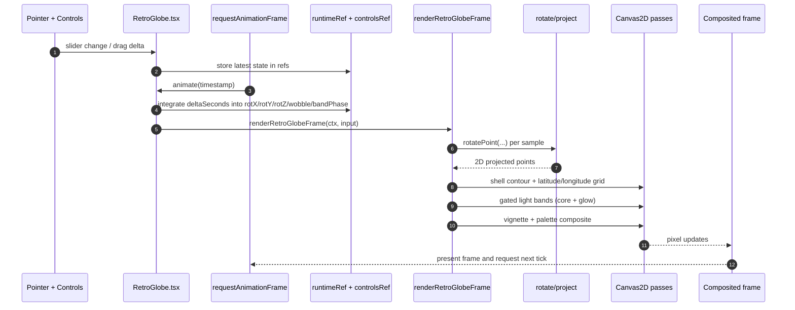

  

    <video autoplay loop muted playsinline preload="metadata">
      <source src="/assets/retroglobe-canvas-migration/retroglobe-css-crop.mp4" type="video/mp4" />
    </video>
    
<em>CSS renderer</em>

  

  

    <video autoplay loop muted playsinline preload="metadata">
      <source src="/assets/retroglobe-canvas-migration/retroglobe-canvas-migration-crop.mp4" type="video/mp4" />
    </video>
    
<em>Canvas renderer</em>

  

## 0. TL;DR

The original globe used layered DOM elements plus synchronized CSS keyframes. The new globe keeps the same retro visual identity, but renders through a canvas frame loop with explicit 3D math in TypeScript.

This change made the renderer easier to reason about, easier to evolve, and less coupled to complex selector/keyframe choreography.

---

## 1. Baseline: Legacy CSS Globe

From the original CSS implementation in git history, the globe used **5 nested structural layers** around the wireframe plus **21 generated wireframe elements** (**9** latitude rings + **12** meridian lines).

Motion was driven by **4 concurrent animation tracks** with pointer-driven transforms layered on top.

Strengths:

- Visual behavior was mostly declarative.
- Individual layers were easy to inspect in DevTools.
- Styling changes were quick for simple cases.

Limitations:

- Renderer behavior was split across many selectors and keyframes.
- Coordination across axes and wobble layers became harder to maintain.
- Adding new rendering effects meant adding more DOM/CSS complexity.

---

## 2. New Canvas Renderer Architecture

The new approach keeps React in charge of controls and interaction, then delegates frame drawing to a dedicated renderer.

### 2.1 System Flow

This is the general JavaScript canvas pattern: collect input state, advance runtime state by frame time, run transform/projection math, then issue layered draw passes.

### 2.2 React Shell Responsibilities (`src/app/RetroGlobe.tsx`)

`RetroGlobe.tsx` now acts as the orchestration layer:

1. Tracks user control state (`lineWidth`, `lineDensity`, axis speeds, wobble, band speed, pause).
2. Stores mutable runtime rotation state in refs for smooth frame updates.
3. Handles drag/touch input and maps it to user rotation offsets.
4. Syncs canvas backing resolution to element size and DPR.
5. Calls `renderRetroGlobeFrame(...)` once per animation frame.

### 2.3 Render Core Responsibilities (`src/lib/retroGlobeCanvas.ts`)

The renderer is a clear draw pipeline:

1. Apply rotational transforms in 3D.
2. Project transformed points with perspective.
3. Draw segmented latitude/longitude wireframe shells.
4. Render gated rotating band highlights (core + glow passes).
5. Finish with vignette and palette-specific compositing.

Control-speed mapping is centralized in:

- `speedLevelToAngularVelocity`
- `wobbleLevelToAngularVelocity`
- `bandLevelToAngularVelocity`

That keeps UI controls and motion behavior consistent.

### 2.4 Why This Architecture Feels Better

- Rendering logic is expressed as code stages instead of distributed animation declarations.
- New effects can be inserted into one renderer pipeline.
- Interaction and drawing concerns are cleaner to separate and test.

---

## 3. why not webgl/three.js?

three.js is massively popular, and it keeps getting more accessible.

  

AI tooling also makes graphics workflows much easier now. That is a good thing. For example, my other project [gravitylens.space](https://gravitylens.space/) is shader-first and uses WebGL-style rendering techniques directly.

### 3.1 Why we still kept this component on 2D canvas

- Browser/driver behavior for WebGL can vary more than Canvas2D in edge cases (context loss, power-saving modes, GPU policy differences).
- A small renderer with line work, segmented bands, and compositing does not need full GPU pipeline complexity.
- Runtime and dependency weight matters when this is one visual module inside a broader site.
- Canvas2D keeps the debugging loop simpler here: points, transforms, and draw passes map directly to code.
- We wanted deterministic behavior across the exact visual style of this wireframe globe, not a general 3D scene framework.

---

## 4. Math: transformation and projection

*Transformation and projection flow used by the canvas frame renderer.*

The canvas renderer is built from straightforward 3D math applied to a sphere before mapping to 2D.

Given latitude $\phi$, longitude $\lambda$, and shell radius $r$, a local point on the sphere is:

$$
\mathbf{p}(\phi,\lambda;r)=
\begin{bmatrix}
r\cos(\phi)\cos(\lambda) \\
r\sin(\phi) \\
r\cos(\phi)\sin(\lambda)
\end{bmatrix}
$$

Rotation matrices:

$$
R_x(\theta_x)=
\begin{bmatrix}
1 & 0 & 0 \\
0 & \cos\theta_x & -\sin\theta_x \\
0 & \sin\theta_x & \cos\theta_x
\end{bmatrix},
\quad
R_y(\theta_y)=
\begin{bmatrix}
\cos\theta_y & 0 & \sin\theta_y \\
0 & 1 & 0 \\
-\sin\theta_y & 0 & \cos\theta_y
\end{bmatrix},
\quad
R_z(\theta_z)=
\begin{bmatrix}
\cos\theta_z & -\sin\theta_z & 0 \\
\sin\theta_z & \cos\theta_z & 0 \\
0 & 0 & 1
\end{bmatrix}
$$

The renderer applies the composed rotation in this order (matching `rotatePoint`):

$$
\mathbf{p}' = R_y(\theta_y)\,R_z(\theta_z)\,R_x(\theta_x)\,\mathbf{p}
$$

Perspective projection with camera distance D, center (cx, cy), and clamped denominator:

$$
\delta = \max\!\left(0.25,\;D-z'\right),\quad
s = \frac{D}{\delta}
$$

$$
x_s = c_x + x' s,\qquad
y_s = c_y + y' s
$$

Depth-based segment alpha (matching `depthAlpha`) is:

$$
\alpha(z') = 0.04 + 0.96\left(\operatorname{clamp}\left(\frac{z'/r + 1}{2}, 0, 1\right)\right)^2
$$

Speed controls are converted to angular velocity with fixed-period mappings:

$$
\omega_{\text{spin}}(l)=\frac{2\pi\cdot \max(l,0.1)}{28},\quad
\omega_{\text{wobble}}(l)=\frac{2\pi\cdot \max(l,0.1)}{12},\quad
\omega_{\text{band}}(l)=
\begin{cases}
0, & l=0 \\
\dfrac{2\pi\cdot \operatorname{clamp}(l,0,5)}{10}, & l>0
\end{cases}
$$

This is the main loop in formula form: rotate, project, depth-gate alpha, draw layered passes, repeat every frame.

---

## 5. Why Canvas Won Here

The migration was not about replacing CSS broadly. It was about moving one rendering-heavy component into a model where behavior is explicit and programmable.

In the CSS version, the visual system was good but mechanically fragmented. In the canvas version, the sphere is one render target with one frame function and well-defined phases.

Tradeoff:

- You own more custom rendering code and math.

Payoff:

- Better long-term control over motion, layering, and effect evolution.

---

## 6. Closing

This migration kept the retro look while changing the implementation model underneath it. The result is a globe renderer that is easier to extend, easier to debug, and easier to iterate on without accumulating more structural CSS complexity.

<video autoplay loop muted playsinline preload="metadata">
  <source src="/assets/retroglobe-canvas-migration/nerv-globe.mp4" type="video/mp4" />
</video>
