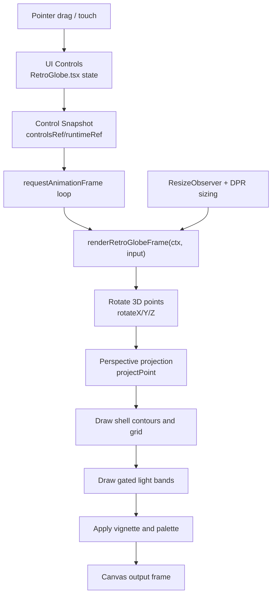

<video autoplay loop muted playsinline controls preload="metadata">
  <source src="/assets/retroglobe-canvas-migration/css_retroglobe.mp4" type="video/mp4" />
</video>
*Top comparison clip: CSS renderer.*

<video autoplay loop muted playsinline controls preload="metadata">
  <source src="/assets/retroglobe-canvas-migration/canvas_retroglobe.mp4" type="video/mp4" />
</video>
*Bottom comparison clip: canvas renderer.*

## 0. TL;DR

The original globe used layered DOM elements plus synchronized CSS keyframes. The new globe keeps the same retro visual identity, but renders through a canvas frame loop with explicit 3D math in TypeScript.

This change made the renderer easier to reason about, easier to evolve, and less coupled to complex selector/keyframe choreography.

---

## 1. Baseline: Legacy CSS Globe

The CSS version was built from nested structural layers:

- `.globe-sphere`
- `.x-rotation-layer`
- `.z-rotation-layer`
- `.tilt-layer`
- `.wireframe-sphere`
- many `.latitude-ring` and `.meridian-line` elements

Motion came from multiple animation tracks (`globe-rotate`, `globe-rotate-x`, `globe-rotate-z`, `globe-wobble`) combined with pointer-driven transforms.

Strengths:

- Visual behavior was mostly declarative.
- Individual layers were easy to inspect in DevTools.
- Styling changes were quick for simple cases.

Limitations:

- Renderer behavior was split across many selectors and keyframes.
- Coordination across axes and wobble layers became harder to maintain.
- Adding new rendering effects meant adding more DOM/CSS complexity.

---

## 2. New Canvas Renderer Architecture

The new approach keeps React in charge of controls and interaction, then delegates frame drawing to a dedicated renderer.

### 2.1 System Flow

### 2.2 React Shell Responsibilities (`src/app/RetroGlobe.tsx`)

`RetroGlobe.tsx` now acts as the orchestration layer:

1. Tracks user control state (`lineWidth`, `lineDensity`, axis speeds, wobble, band speed, pause).
2. Stores mutable runtime rotation state in refs for smooth frame updates.
3. Handles drag/touch input and maps it to user rotation offsets.
4. Syncs canvas backing resolution to element size and DPR.
5. Calls `renderRetroGlobeFrame(...)` once per animation frame.

### 2.3 Render Core Responsibilities (`src/lib/retroGlobeCanvas.ts`)

The renderer is a clear draw pipeline:

1. Apply rotational transforms in 3D.
2. Project transformed points with perspective.
3. Draw segmented latitude/longitude wireframe shells.
4. Render gated rotating band highlights (core + glow passes).
5. Finish with vignette and palette-specific compositing.

Control-speed mapping is centralized in:

- `speedLevelToAngularVelocity`
- `wobbleLevelToAngularVelocity`
- `bandLevelToAngularVelocity`

That keeps UI controls and motion behavior consistent.

### 2.4 Why This Architecture Feels Better

- Rendering logic is expressed as code stages instead of distributed animation declarations.
- New effects can be inserted into one renderer pipeline.
- Interaction and drawing concerns are cleaner to separate and test.

---

## 3. Why Canvas Won Here

The migration was not about replacing CSS broadly. It was about moving one rendering-heavy component into a model where behavior is explicit and programmable.

In the CSS version, the visual system was good but mechanically fragmented. In the canvas version, the sphere is one render target with one frame function and well-defined phases.

Tradeoff:

- You own more custom rendering code and math.

Payoff:

- Better long-term control over motion, layering, and effect evolution.

---

## 4. Closing

This migration kept the retro look while changing the implementation model underneath it. The result is a globe renderer that is easier to extend, easier to debug, and easier to iterate on without accumulating more structural CSS complexity.
